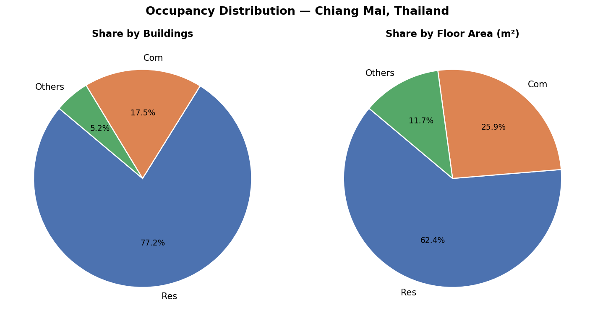
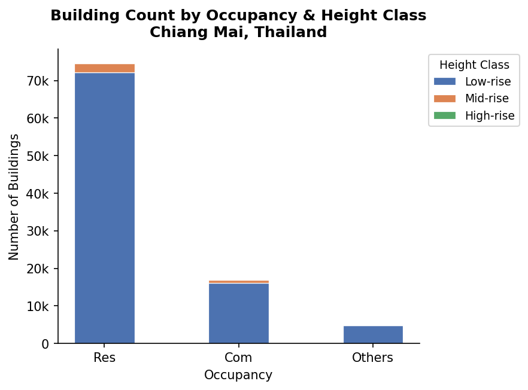

# Building Exposure Module — Chiang Mai, Thailand

> This repository provides a building-level exposure dataset for seismic risk assessment in Chiang Mai Province, Thailand. The dataset was developed as part of a catastrophe (CAT) model for earthquake loss estimation compatible with the **OpenQuake Engine** framework. Building attributes including structural type, occupancy class, floor area, and height were derived from a multi-source survey campaign covering ~96,635 assets.

* * *

## Repository Structure

```
exposure-module/
├── data/
│   ├── Exposure-Module.csv            # Building-level exposure (~96,635 assets)
│   ├── Replacement Cost.csv           # Building replacement cost (Thai Valuers Association)
│   └── Building Occupants.csv                  # Daytime & nighttime occupant counts
├── results/
│   ├── Exposure_Summary_OccClass.csv  # Building count & area by occupancy class
│   ├── Exposure_Summary_Taxonomy.csv  # Building count & area by GEM taxonomy
│   ├── Exposure_Summary_STType.csv    # Building count & area by structural type
│   ├── Exposure_Summary_StoryClass.csv# Building count & area by height class
│   ├── expo_occ_buildings.png         # Chart: buildings by occupancy (Res/Com/Others)
│   ├── expo_occ_pie.png               # Chart: occupancy share pie (Res/Com/Others)
│   └── expo_story_class.png           # Chart: buildings by height class
├── scripts/
│   └── analyze.py                     # Analysis & figure generation script
└── README.md
```

* * *

## Country Summary

### Occupancy Distribution




* * *

### Height Class Distribution

| Class | Stories | Buildings | Share |
|---|---|---|---|
| Low-rise | 1–3 | 93,019 | 96.26% |
| Mid-rise | 4–9 | 3,517 | 3.64% |
| High-rise | 10+ | 99 | 0.10% |



* * *

## Building Inventory

The exposure dataset covers **96,635 buildings** across Chiang Mai Province collected through three survey methods:

| Tag | Survey Method | Buildings |
|---|---|---|
| `GSV` | Google Street View | 88,848 |
| `FieldSurvey` | In-person field survey (Round 1) | 3,564 |
| `FieldSurveyR2` | In-person field survey (Round 2) | 4,223 |

### Occupancy Classes

Occupancy follows the **HAZUS classification** system, grouped into three categories:

| Category | HAZUS Classes | Buildings | Share |
|---|---|---|---|
| `Res` | RES1–RES6 | 74,650 | 77.25% |
| `Com` | COM1–COM10 | 16,952 | 17.54% |
| `Others` | IND1–6, AGR1, REL1, GOV1–2, EDU1–2 | 5,033 | 5.21% |

### Structural Types

Building structural types follow the **HAZUS SIC** classification as used in the Basic-Level Building Survey Form:

| Code | GEM Macro-Taxonomy | Description | Stories |
|---|---|---|---|
| `W1` | W | Wood (≤ 465 m²) | 1 |
| `W2` | W | Wood (> 465 m²) | 2+ |
| `S1` | S/MF | Steel Moment Frame | 1–3 / 4–7 / 8+ |
| `S2` | S/BF | Steel Braced Frame | 1–3 / 4–7 / 8+ |
| `S3` | S/LF | Steel Light Frame | All |
| `S4` | S/LWAL | Steel Frame with Cast-in-Place Concrete Shear Walls | 1–3 / 4–7 / 8+ |
| `S5` | S/LFINF | Steel Frame with Unreinforced Masonry Infill Walls | 1–3 / 4–7 / 8+ |
| `C1` | CR/MF | Concrete Moment Frame | 1–3 / 4–7 / 8+ |
| `C2` | CR/LWAL | Concrete Shear Walls | 1–3 / 4–7 / 8+ |
| `C3` | CR/LFINF | Concrete Frame with Unreinforced Masonry Infill Walls | 1–3 / 4–7 / 8+ |
| `C4` | CR/LFINF+FS | Concrete Frame with Unreinforced Masonry Infill Walls (Flat Slab) | 1–3 / 4–7 / 8+ |
| `PC1` | PCR/LWAL | Precast Concrete Tilt-Up Walls | All |
| `PC2` | PCR/LDUAL | Precast Concrete Frames with Concrete Shear Walls | 1–3 / 4–7 / 8+ |
| `RM1` | MR/LWAL | Reinforced Masonry Bearing Walls with Wood or Metal Deck Diaphragms | 1–3 / 4+ |
| `RM2` | MR/LWAL | Reinforced Masonry Bearing Walls with Precast Concrete Diaphragms | 1–3 / 4–7 / 8+ |
| `URM` / `URML` | MUR/LWAL | Unreinforced Masonry Bearing Walls | 1–2 / 3+ |
| `MH` | MH | Mobile Homes | All |

* * *

## Statistics: Old vs New

Numbers compared between the prior dataset (100,352 buildings, partially imputed) and the current CSV (96,635 buildings, fully surveyed).

### Overall Summary

| Metric | Old (paper draft) | **New (current CSV)** | Status |
|---|---|---|---|
| Total buildings | 100,352 | **96,635** | ✏️ Updated |
| Complete / surveyed | 92,646 (92.32%) | **96,635 (100%)** | ✏️ Updated |
| Statistically imputed | 7,706 | **0** | ✏️ Updated |
| Total floor area | — | **38,967,956 m²** | — |

### Structural Type (Full Dataset)

| Metric | Old | **New** | Status |
|---|---|---|---|
| C3 (post-imputation) | 85,149 (84.85%) | **80,849 (83.66%)** | ✏️ Updated |
| C3 (§5 conclusion %) | 83.70% | **83.66%** | ✏️ Updated |
| Wood W1+W2 (§5) | 5.74% | **5.91%** | ✏️ Updated |
| Steel S1–S5 (§5) | 4.21% | **4.31%** | ✏️ Updated |

### Occupancy (Full Dataset)

| Metric | Old | **New** | Status |
|---|---|---|---|
| RES1 % (§5 conclusion) | 70.20% | **70.24%** | ✏️ Updated |
| Residential total | — | **74,650 (77.25%)** | — |
| Commercial total | — | **16,952 (17.54%)** | — |
| Others | — | **5,033 (5.21%)** | — |

### Cross-Tab (ST_TYPE × OC_CLASS)

| Combination | Old | **New** | Status |
|---|---|---|---|
| RES1 + C3 | 63,689 (63.46%) | **61,071 (63.20%)** | ✏️ Updated |
| COM1 + C3 | 6,927 (6.90%) | **5,697 (5.90%)** | ✏️ Updated |
| RES1 + W1 | 4,540 (4.52%) | **4,565 (4.72%)** | ✏️ Updated |

### Survey Method Breakdown

| Method | Old CSV | **New CSV** | Change |
|---|---|---|---|
| GSV | 96,607 | **88,848** | −7,759 |
| Field Survey Round 1 | 3,745 | **3,564** | −181 |
| Field Survey Round 2 | — | **4,223** | +4,223 (new) |
| **Total** | **100,352** | **96,635** | −3,717 |

### Numbers Still Pending (need original survey records)

These describe the GSV pipeline workflow and cannot be derived from the final CSV because removed buildings (open spaces, screened non-buildings) are not in the dataset.

| Number in paper | Old value | Status |
|---|---|---|
| Actively utilized buildings (post-screening) | 103,743 | ❓ Need from records |
| GSV Round 1 complete | 72,491 | ❓ Need from records |
| Total needing supplement | 31,252 | ❓ Need from records |
| Open spaces identified in GSV2 | 3,391 (10.85%) | ❓ Need from records |
| GSV2 classified % | 64.49% | ❓ Recalculate once open spaces known |
| Inaccessible % | 24.66% | ❓ Recalculate once open spaces known |

> Once the open-spaces count is confirmed, all six values above can be recomputed in one pass.

### Known Inconsistencies in Paper Draft

| Section | Issue |
|---|---|
| §4.2.1 vs §4.2.3 vs §5 | C3 share of basic-level survey reported as 75.21%, 75.30%, and 80.89% in three places |
| §4.2.5 | Normal-condition total stated as 2,843 but RES (1,915) + COM (695) = 2,610 — sum does not match |
| §4.3 | Cites 72,049 buildings (65.63%) as C3 basis — denominator unclear; figure not present in either CSV version |

* * *

## Data Description

### `Exposure-Module.csv`

| Field | Type | Description |
|---|---|---|
| `BLDGID` | Integer | Unique building identifier |
| `LAT` / `LONG` | Double | Building centroid coordinates (WGS 84) |
| `AREA` | Double | Building footprint area (m²) |
| `FL_AREA` | Double | Total floor area (m²) |
| `STORY` | Integer | Number of stories |
| `ST_TYPE` | Text | Structural type (HAZUS, e.g., C3) |
| `OC_CLASS` | Text | Occupancy class (HAZUS, e.g., RES1, COM1) |
| `Tag` | Text | Survey source (`GSV`, `FieldSurvey`, `FieldSurveyR2`) |
| `Condition` | Text | Building condition rating |
| `AGE` | Text | Building age class |
| `Cluster` | Integer | Spatial cluster ID |

### `Replacement Cost.csv`

Building replacement cost data sourced from the **Thai Valuers Association**. Due to discrepancies between the association's building categories and the occupancy classes defined in this study, a matching process was implemented to align replacement costs with the corresponding occupancy classes.

### `Building Occupants.csv`

Occupant counts collected through walking surveys by directly interviewing residents. Two time points were recorded per building:

| Time | Type |
|---|---|
| 14:00 (2:00 PM) | Daytime occupants |
| 02:00 (2:00 AM) | Nighttime occupants |

The collected data were subsequently aggregated using a **weighted arithmetic mean**, as presented in the file.

* * *

## Coordinate Reference System

- **WGS 1984 UTM Zone 47N** (EPSG: 32647)

## Reproducing the Analysis

```bash
python scripts/analyze.py
```

Requires: `pandas`, `matplotlib`, `numpy`

* * *

## Citation

> *To be updated upon publication.*

## Funding

This work was supported by the **National Research Council of Thailand (NRCT)**, grant number **N25A680575**, and carried out at the **Asian Institute of Technology (AIT)**.
