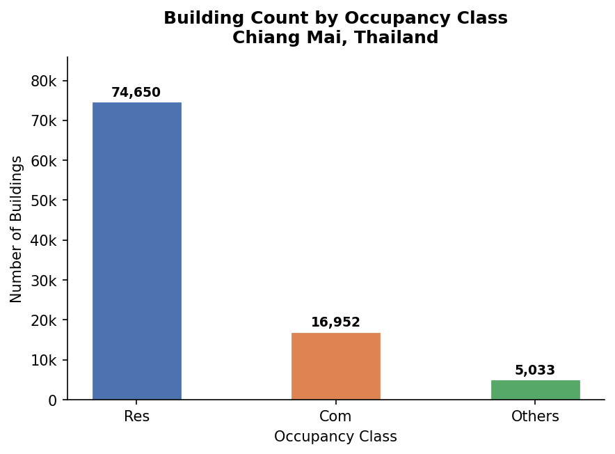
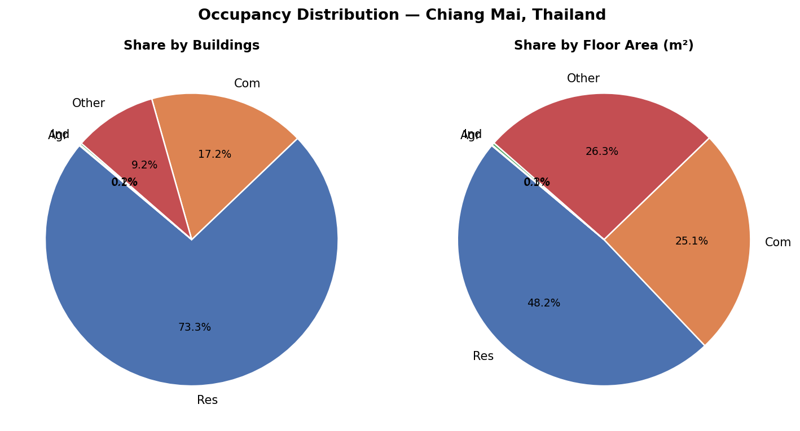
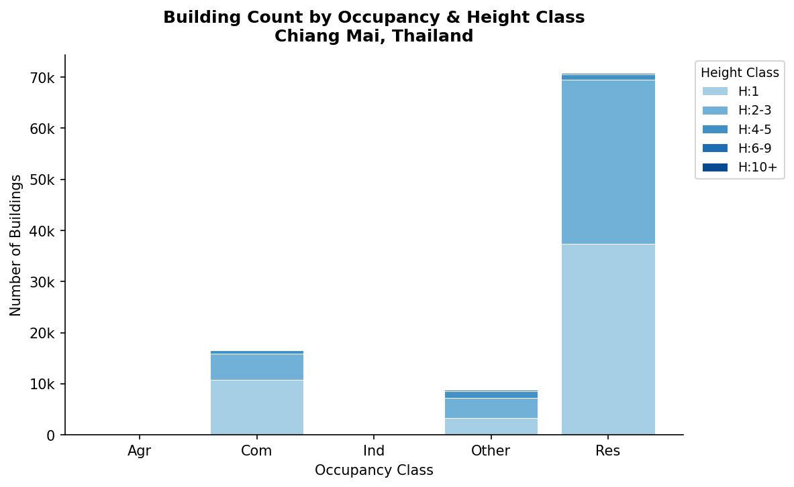

# Building Exposure Module — Chiang Mai, Thailand

> This repository provides a building-level exposure dataset for seismic risk assessment in Chiang Mai Province, Thailand. The dataset was developed as part of a catastrophe (CAT) model for earthquake loss estimation compatible with the **OpenQuake Engine** framework. Building attributes including structural type, occupancy class, floor area, and height were derived from a multi-source survey campaign covering ~96,635 assets.

* * *

## Repository Structure

```
exposure-module/
├── Exposure-Module.csv                # Building-level exposure (~96,635 assets)
├── Exposure_Summary_OccClass.csv      # Building count & area by occupancy class
├── Exposure_Summary_Taxonomy.csv      # Building count & area by GEM taxonomy
├── Exposure_Summary_STType.csv        # Building count & area by structural type
├── Exposure_Summary_StoryClass.csv    # Building count & area by height class
├── expo_occ_buildings.png             # Chart: buildings by occupancy
├── expo_occ_pie.png                   # Chart: occupancy share (pie)
├── expo_story_class.png               # Chart: buildings by height class
└── analyze.py                         # Analysis & figure generation script
```

* * *

## Country Summary

### Occupancy Distribution





* * *

### Height Class Distribution



* * *

## Building Inventory

The exposure dataset covers **96,635 buildings** across Chiang Mai Province collected through three survey methods:

| Survey Method | Description |
|---|---|
| Google Street View (MU) | Street-level imagery within Chiang Mai Municipality |
| Google Street View (Space) | Satellite/aerial imagery |
| UAV Survey | Drone-based aerial survey |
| Walk Survey Round 1 & 2 | In-person field verification |

### Occupancy Classes

Occupancy follows the **HAZUS classification** system, mapped to GEM categories:

| GEM Category | HAZUS Classes | Description |
|---|---|---|
| `Res` | RES1–RES6 | Residential buildings |
| `Com` | COM1–COM10 | Commercial buildings |
| `Ind` | IND1–IND6 | Industrial buildings |
| `Agr` | AGR1 | Agricultural buildings |
| `Other` | REL1, GOV1–2, EDU1–2 | Religious, government, educational |

### Structural Types

Building structural types follow the **HAZUS SIC** classification as used in the Basic-Level Building Survey Form:

| Code | GEM Macro-Taxonomy | Description | Stories |
|---|---|---|---|
| `W1` | W | Wood (≤ 465 m²) | 1 |
| `W2` | W | Wood (> 465 m²) | 2+ |
| `S1` | S/MF | Steel Moment Frame | 1–3 / 4–7 / 8+ |
| `S2` | S/BF | Steel Braced Frame | 1–3 / 4–7 / 8+ |
| `S3` | S/LF | Steel Light Frame | All |
| `S4` | S/LWAL | Steel Frame with Cast-in-Place Concrete Shear Walls | 1–3 / 4–7 / 8+ |
| `S5` | S/LFINF | Steel Frame with Unreinforced Masonry Infill Walls | 1–3 / 4–7 / 8+ |
| `C1` | CR/MF | Concrete Moment Frame | 1–3 / 4–7 / 8+ |
| `C2` | CR/LWAL | Concrete Shear Walls | 1–3 / 4–7 / 8+ |
| `C3` | CR/LFINF | Concrete Frame with Unreinforced Masonry Infill Walls | 1–3 / 4–7 / 8+ |
| `C4` | CR/LFINF+FS | Concrete Frame with Unreinforced Masonry Infill Walls (Flat Slab) | 1–3 / 4–7 / 8+ |
| `PC1` | PCR/LWAL | Precast Concrete Tilt-Up Walls | All |
| `PC2` | PCR/LDUAL | Precast Concrete Frames with Concrete Shear Walls | 1–3 / 4–7 / 8+ |
| `RM1` | MR/LWAL | Reinforced Masonry Bearing Walls with Wood or Metal Deck Diaphragms | 1–3 / 4+ |
| `RM2` | MR/LWAL | Reinforced Masonry Bearing Walls with Precast Concrete Diaphragms | 1–3 / 4–7 / 8+ |
| `URM` / `URML` | MUR/LWAL | Unreinforced Masonry Bearing Walls | 1–2 / 3+ |
| `MH` | MH | Mobile Homes | All |

* * *

## Data Description

### `Exposure-Module.csv`

| Field | Type | Description |
|---|---|---|
| `BLDGID` | Integer | Unique building identifier |
| `LAT` / `LONG` | Double | Building centroid coordinates (WGS 84) |
| `AREA` | Double | Building footprint area (m²) |
| `FL_AREA` | Double | Total floor area (m²) |
| `STORY` | Integer | Number of stories |
| `ST_TYPE` | Text | Structural type (HAZUS, e.g., C3) |
| `OC_CLASS` | Text | Occupancy class (HAZUS, e.g., RES1, COM1) |
| `Tag` | Text | Survey source tag |
| `Condition` | Text | Building condition rating |
| `AGE` | Text | Building age class |
| `Cluster` | Integer | Spatial cluster ID |
| `GG_SURVEY_MU` | Integer | Google Street View survey flag (MU area) |
| `GG_SURVEY_SPACE` | Integer | Google Street View survey flag (space imagery) |
| `GG_SURVEY_UAV` | Integer | UAV survey flag |
| `WK_SURVEY_R1` | Integer | Walk survey round 1 flag |
| `WK_SURVEY_R2` | Integer | Walk survey round 2 flag |
| `TRUEEXPOSURE` | Integer | Verified exposure record flag |
| `Extrapolated` | Integer | Statistically imputed record flag |

* * *

## Coordinate Reference System

- **WGS 1984 UTM Zone 47N** (EPSG: 32647)

## Reproducing the Analysis

```bash
python analyze.py
```

Requires: `pandas`, `matplotlib`, `numpy`

* * *

## Citation

> *To be updated upon publication.*

## Funding

This work was supported by the **National Research Council of Thailand (NRCT)**, grant number **N25A680575**, and carried out at the **Asian Institute of Technology (AIT)**.
