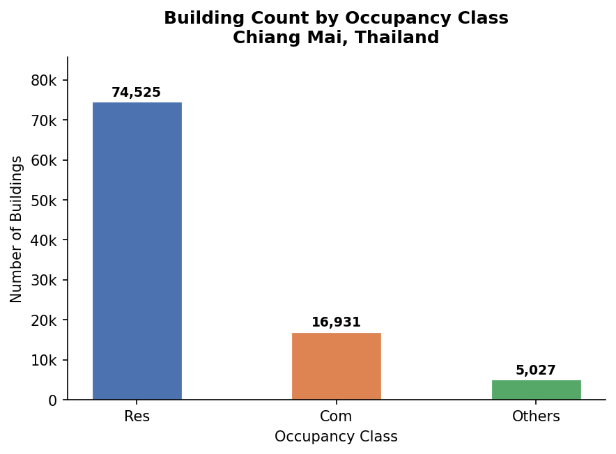
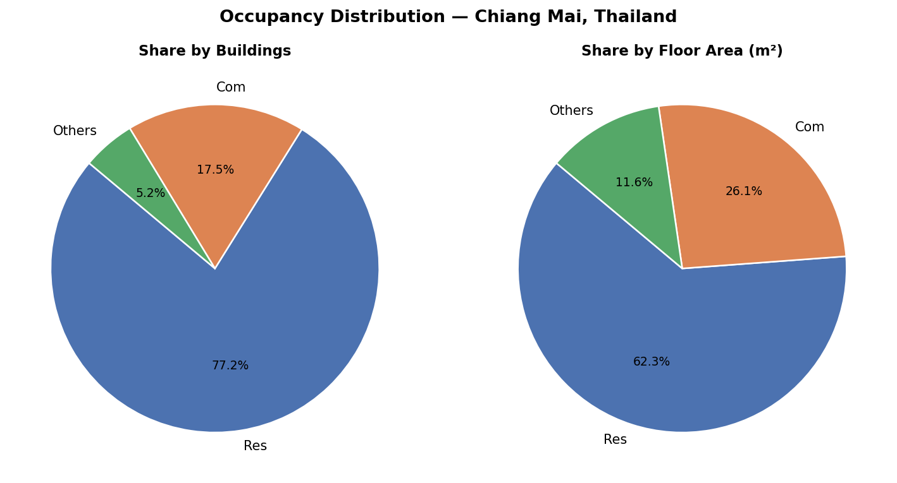
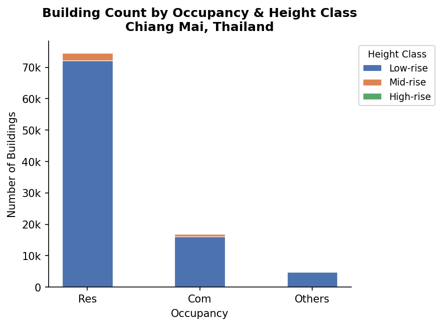

# Building Exposure Module — Chiang Mai, Thailand

> This repository provides a building-level exposure dataset for seismic risk assessment in Chiang Mai Province, Thailand. Building attributes including structural type, occupancy class, floor area, and height were derived from a multi-source survey campaign covering ~96,483 assets.

* * *

## Repository Structure

```
exposure-module/
├── data/
│   ├── Exposure-Module.csv            # Building-level exposure (~96,483 assets)
│   ├── Replacement Cost.csv           # Building replacement cost (Thai Valuers Association)
│   └── Building Occupants.csv                  # Daytime & nighttime occupant counts
├── results/
│   ├── Exposure_Summary_OccClass.csv  # Building count & area by occupancy class
│   ├── Exposure_Summary_Taxonomy.csv  # Building count & area by GEM taxonomy
│   ├── Exposure_Summary_STType.csv    # Building count & area by structural type
│   ├── Exposure_Summary_StoryClass.csv# Building count & area by height class
│   ├── expo_occ_buildings.png         # Chart: buildings by occupancy (Res/Com/Others)
│   ├── expo_occ_pie.png               # Chart: occupancy share pie (Res/Com/Others)
│   └── expo_story_class.png           # Chart: buildings by height class
├── scripts/
│   └── analyze.py                     # Analysis & figure generation script
└── README.md
```

* * *

## Exposure Summary

### Occupancy Distribution





* * *

### Height Class Distribution

| Class | Stories | Buildings | Share |
|---|---|---|---|
| Low-rise | 1–3 | 92,877 | 96.26% |
| Mid-rise | 4–9 | 3,507 | 3.63% |
| High-rise | 10+ | 99 | 0.10% |



* * *

## Building Inventory

The exposure dataset covers **96,483 buildings** across Chiang Mai Province collected through two survey methods:

| Tag | Survey Method | Buildings |
|---|---|---|
| `GSV` | Google Street View (incl. mobile-360° / drone imagery) | 92,933 |
| `FieldSurvey` | In-person field survey (Basic-Level sample) | 3,550 |

### Occupancy Classes

Occupancy follows the **HAZUS classification** system, grouped into three categories:

| Category | HAZUS Classes | Buildings | Share |
|---|---|---|---|
| `Res` | RES1–RES6 | 74,525 | 77.24% |
| `Com` | COM1–COM10, COM1T | 16,931 | 17.55% |
| `Others` | IND1–6, AGR1, REL1, GOV1–2, EDU1–2 | 5,027 | 5.21% |

### Structural Types

Building structural types follow the **HAZUS SIC** classification as used in the Basic-Level Building Survey Form:

| Code | GEM Macro-Taxonomy | Description | Stories |
|---|---|---|---|
| `W1` | W | Wood (≤ 465 m²) | 1 |
| `W2` | W | Wood (> 465 m²) | 2+ |
| `S1` | S/MF | Steel Moment Frame | 1–3 / 4–7 / 8+ |
| `S2` | S/BF | Steel Braced Frame | 1–3 / 4–7 / 8+ |
| `S3` | S/LF | Steel Light Frame | All |
| `S4` | S/LWAL | Steel Frame with Cast-in-Place Concrete Shear Walls | 1–3 / 4–7 / 8+ |
| `S5` | S/LFINF | Steel Frame with Unreinforced Masonry Infill Walls | 1–3 / 4–7 / 8+ |
| `C1` | CR/MF | Concrete Moment Frame | 1–3 / 4–7 / 8+ |
| `C2` | CR/LWAL | Concrete Shear Walls | 1–3 / 4–7 / 8+ |
| `C3` | CR/LFINF | Concrete Frame with Unreinforced Masonry Infill Walls | 1–3 / 4–7 / 8+ |
| `C4` | CR/LFINF+FS | Concrete Frame with Unreinforced Masonry Infill Walls (Flat Slab) | 1–3 / 4–7 / 8+ |
| `PC1` | PCR/LWAL | Precast Concrete Tilt-Up Walls | All |
| `PC2` | PCR/LDUAL | Precast Concrete Frames with Concrete Shear Walls | 1–3 / 4–7 / 8+ |
| `RM1` | MR/LWAL | Reinforced Masonry Bearing Walls with Wood or Metal Deck Diaphragms | 1–3 / 4+ |
| `RM2` | MR/LWAL | Reinforced Masonry Bearing Walls with Precast Concrete Diaphragms | 1–3 / 4–7 / 8+ |
| `URM` / `URML` | MUR/LWAL | Unreinforced Masonry Bearing Walls | 1–2 / 3+ |
| `MH` | MH | Mobile Homes | All |

#### Combined structural types

A small number of buildings were recorded with two combined HAZUS structural
types, for example `C3+W1` where a reinforced-concrete frame and a timber
structure occur in the same building. The GEM Building Taxonomy describes a
single lateral load-resisting system per building, so these combinations have
no direct equivalent and are recorded as **`N/A`** in the `MACRO_TAXO` and
`TAXONOMY` fields. The full HAZUS code is always retained in `ST_TYPE`, so no
information is lost.

This affects **696 buildings (0.72%)** across 22 combined codes, the most
frequent being `C3+W1` (397), `C4+C2` (93), `C3+W` (60) and `C3+W2` (58).

> **Note for `pandas` users:** `N/A` is in the default null-value list, so
> `read_csv` returns `NaN` for these fields unless `keep_default_na=False`
> is passed.

* * *

## Classification Systems

The dataset carries two parallel building classification systems.

| Field | System | Where |
|---|---|---|
| `ST_TYPE` | HAZUS structural type, e.g. `C3`, `W1`, `C3+W1` | `data/Exposure-Module.csv` |
| `OC_CLASS` | HAZUS occupancy class, e.g. `RES1`, `COM1` | `data/Exposure-Module.csv` |
| `MACRO_TAXO` | GEM macro-taxonomy | `results/Exposure_Summary_Taxonomy.csv` |
| `TAXONOMY` | Full GEM Building Taxonomy string | `results/Exposure_Summary_Taxonomy.csv` |

**`MACRO_TAXO`** is a simplified classification grouping buildings by
predominant construction material and lateral load-resisting system —
`CR/LFINF`, `CR/MF`, `W`, `S/MF` and so on. The HAZUS-to-GEM mapping applied
is given in the Structural Types table above.

**`TAXONOMY`** combines the macro-taxonomy with a height band and the HAZUS
occupancy class, for example `CR/LFINF/H:2-3/COM1`. Height bands are `H:1`,
`H:2-3`, `H:4-5`, `H:6-9` and `H:10+`.

HAZUS classifications are used throughout the accompanying study; the GEM
taxonomy is provided so the dataset can be used directly with the OpenQuake
Engine.

* * *

## Data Description

### `Exposure-Module.csv`

| Field | Type | Description |
|---|---|---|
| `BLDGID` | Integer | Unique building identifier |
| `LAT` / `LONG` | Double | Building centroid coordinates (WGS 84) |
| `AREA` | Double | Building footprint area (m²) |
| `FL_AREA` | Double | Total floor area (m²) |
| `STORY` | Integer | Number of stories |
| `ST_TYPE` | Text | Structural type (HAZUS, e.g., C3) |
| `OC_CLASS` | Text | Occupancy class (HAZUS, e.g., RES1, COM1) |
| `Tag` | Text | Source of the final attributes (`GSV`, `FieldSurvey`) |
| `Condition` | Text | Building condition rating |
| `AGE` | Text | Building age class |
| `Cluster` | Integer | Spatial cluster ID |

### `Replacement Cost.csv`

Building replacement cost data sourced from the **Thai Valuers Association**. Due to discrepancies between the association's building categories and the occupancy classes defined in this study, a matching process was implemented to align replacement costs with the corresponding occupancy classes.

### `Building Occupants.csv`

Occupant counts collected through walking surveys by directly interviewing residents. Two time points were recorded per building:

| Time | Type |
|---|---|
| 14:00 (2:00 PM) | Daytime occupants |
| 02:00 (2:00 AM) | Nighttime occupants |

The collected data were subsequently aggregated using a **weighted arithmetic mean**, as presented in the file.

* * *

## Coordinate Reference System

- **WGS 1984 UTM Zone 47N** (EPSG: 32647)

## Reproducing the Analysis

```bash
python scripts/analyze.py
```

Requires: `pandas`, `matplotlib`, `numpy`

* * *

## Citation

> *To be updated upon publication.*

## Funding

This work was supported by the **National Research Council of Thailand (NRCT)**, grant number **N25A680575**, and carried out at the **Asian Institute of Technology (AIT)**.
